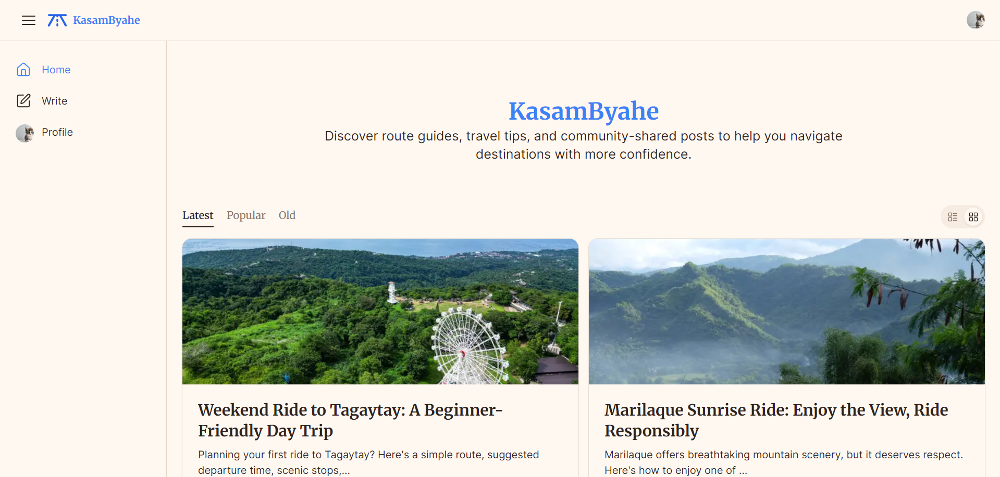

# KasamByahe 🛵

KasamByahe is a community-driven travel and route-sharing platform built with **Next.js**. It allows users to discover destination guides, travel tips, and community discussions that help riders and drivers navigate the Philippines with more confidence.

The project was built as a **2-week internship project**, focusing on building a production-ready full-stack application using modern web technologies.

---

## ✨ Features

### Authentication
- Secure authentication with Clerk
- User profile integration
- Protected actions for authenticated users

### Blog Posts
- Create, edit, and delete blog posts
- Rich text editor powered by BlockNote
- Upload cover images using UploadThing
- Responsive blog post pages
- Automatic slug generation

### Community Interaction
- Like and unlike blog posts
- Paginated comments
- Optimistic UI updates for commenting
- Comment Moderation

### User Experience
- Responsive design
- Skeleton loading states
- Empty states
- Relative timestamps
- Mobile-friendly navigation
---

## 🖼️ Screenshots


---

## 🛠 Tech Stack

### Frontend

- Next.js 15 (App Router)
- React 19
- TypeScript
- Tailwind CSS v4
- shadcn/ui
- Lucide React

### Backend

- Next.js Server Actions
- Drizzle ORM
- Neon PostgreSQL

### Authentication

- Clerk

### Rich Text Editor

- BlockNote

### File Uploads

- UploadThing

### Deployment

- Vercel

---

## 📂 Project Structure

```
app/
components/
lib/
 ├── actions/
 ├── auth/
 ├── db/
 ├── schema/
 ├── types/
 ├── validations/
 ├── utils/
scripts/
public/
```

---

## 🚀 Getting Started

### 1. Clone the repository

```bash
git clone https://github.com/juicethyn/kasambyahe-blog-post.git

cd kasambyahe-blog-post
```

---

### 2. Install dependencies

```bash
pnpm install
```

---

### 3. Configure environment variables

Create a `.env.local` file.

Example:

```env
DATABASE_URL=

NEXT_PUBLIC_CLERK_PUBLISHABLE_KEY=
CLERK_SECRET_KEY=

UPLOADTHING_TOKEN=
UPLOADTHING_SECRET=
UPLOADTHING_APP_ID=

SEED_CLERK_USER_ID= 
```

---

### 4. Run database migrations

```bash
pnpm db:generate

pnpm db:migrate
```

---

### 5. Seed the database

```bash
pnpm db:seed
```

---

### 6. Start development server

```bash
pnpm dev
```

Open

```
http://localhost:3000
```

---

## 📖 Available Scripts

```bash
pnpm dev

pnpm build

pnpm start

pnpm db:generate

pnpm db:migrate

pnpm db:seed
```

---

## Database

The project uses:

- Neon PostgreSQL
- Drizzle ORM

Current schema includes:

- Users
- Posts
- Comments
- Likes

---

## Features Implemented

- ✅ Authentication
- ✅ Rich Text Editor
- ✅ Image Uploads
- ✅ Blog CRUD
- ✅ Likes
- ✅ Comments
- ✅ User Profile
- ✅ Responsive UI
- ✅ Skeleton Loading
- ✅ Deployment

---

## Future Improvements

Some features planned for future versions include:

- Saved Posts
- Search
- Categories & Tags
- Notifications
- Infinite Scrolling
- Richer analytics
- Admin dashboard

---

## Author

Developed by **Juzzthyn Griey Perez**

GitHub:
https://github.com/juicethyn

LinkedIn:
https://www.linkedin.com/in/juzzthynperez/

---

## License

This project is for educational and portfolio purposes.
